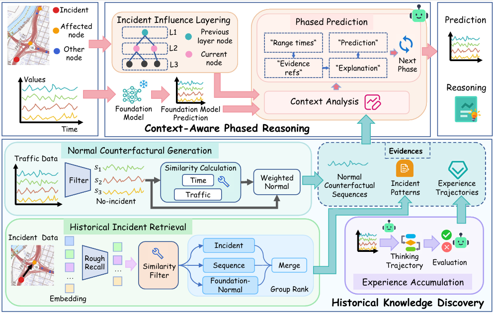

# RAP Phased Retrieval-Augmented Reasoning for Incident-Aware Traffic Prediction

<p align="center">

</p>

A phased retrieval-augmented reasoning framework for incident-aware traffic prediction that combines a foundation spatio-temporal model with LLM-based contextual reasoning. RAP consists of two key components. Historical Knowledge Discovery extracts three complementary forms of transferable, heterogeneous evidence from historical traffic data: incident patterns, normal counterfactual sequences, and experience trajectories. Specifically, RAP retrieves similar historical incident cases to identify previously observed incident-induced effects and selects incident-free traffic windows from the same target node to construct normal counterfactual sequences that characterize ordinary traffic patterns. It further summarizes completed forecasting episodes, including their contexts, predictions, observed outcomes, and reflections, into reusable experience trajectories. Together, these sources provide complementary empirical evidence for reasoning about incident-induced traffic dynamics, addressing. Context-Aware Phased Reasoning organizes the heterogeneous evidence into a context analysis process and a phased prediction process driven by an LLM. It first evaluates the relevance and reliability of the retrieved evidence, consolidating complementary and conflicting signals into a compact context. It then partitions the forecasting horizon into distinct impact phases (e.g., disruption and recovery) and performs phase-consistent reasoning to generate reliable predictions, addressing.

## Install

Use Python 3.10 or newer. Install the runtime dependencies in an isolated
environment:

```bash
cd RAP
python -m venv .venv
source .venv/bin/activate
pip install -r requirements.txt
```

## External assets

Create the following layout after downloading the prepared dataset and model
artifacts from the project's network-drive location:

```text
RAP/
├── data/processed/<region>_2024/
│   ├── node_order.npy
│   ├── sensor_meta_feature.csv
│   ├── adj_matrix.npy
│   ├── incidents_y2024.csv
│   ├── year_2024/2024_pXX.npy
│   └── ...
├── artifacts_<region>/
│   ├── models/<model>_<region>.pt
│   └── retrieval/                 # generated or copied caches
└── src/llmmanager/providers.json
```

The dataset download [[Google Drive]](https://drive.google.com/file/d/15Zk2RaGPExvhzzV0qyOmdd9zE9uFNqGT/view?usp=drive_link) is distributed separately with the project. Keep the
download outside version control and unpack it under `RAP/data/`.

## Provider configuration

`src/llmmanager/providers.json` is a sanitized OpenAI-compatible template. It
contains no credential. Set the key before an LLM run:

```bash
export RAP_LLM_API_KEY='your-api-key'
```

Change `base_url` and `model` in that file for another OpenAI-compatible
provider. The exact `${ENV_VAR}` form is expanded once at process startup and
the resulting provider settings are frozen for the run.

## Run

From any directory, invoke the wrapper; it changes to the RAP root before
loading relative paths:

```bash
python RAP/main.py \
  --region sacramento \
  --data-dir data/processed/sacramento_2024 \
  --checkpoint artifacts_sacramento/models/agcrn_sacramento.pt \
  --output-dir outputs/incident-evaluations/sacramento/agcrn/tool-llm \
  --incident-id 123456 \
  --call-llm
```

For a normal multi-case selection, omit `--incident-id` and use
`--select-count`/`--select-month`. `--incident-workers`, `--device`, and
`--config` expose the same controls as the current project entry point.

## Configuration

`configs/default.json` preserves the current context switches and retrieval
groups. In particular, `base_prediction` controls loading the foundation model
and all Base-dependent retrieval; `normal_reference` controls Normal retrieval
and all Normal-dependent evidence. `phased_prediction` selects the current
structured phase output contract. The three incident retrieval groups and
their top-k values are configured independently under `retrieval`.

## Repository contents

```text
RAP/
├── main.py                 # standalone entry point
├── configs/default.json    # current runtime configuration
├── configs/models/         # supported checkpoint model configurations
├── src/                    # copied Tool LLM runtime and model implementations
├── data/                   # empty dataset mount point
├── artifacts/              # empty generated-cache mount point
├── outputs/                # empty generated-output mount point
├── requirements.txt
└── README.md
```

